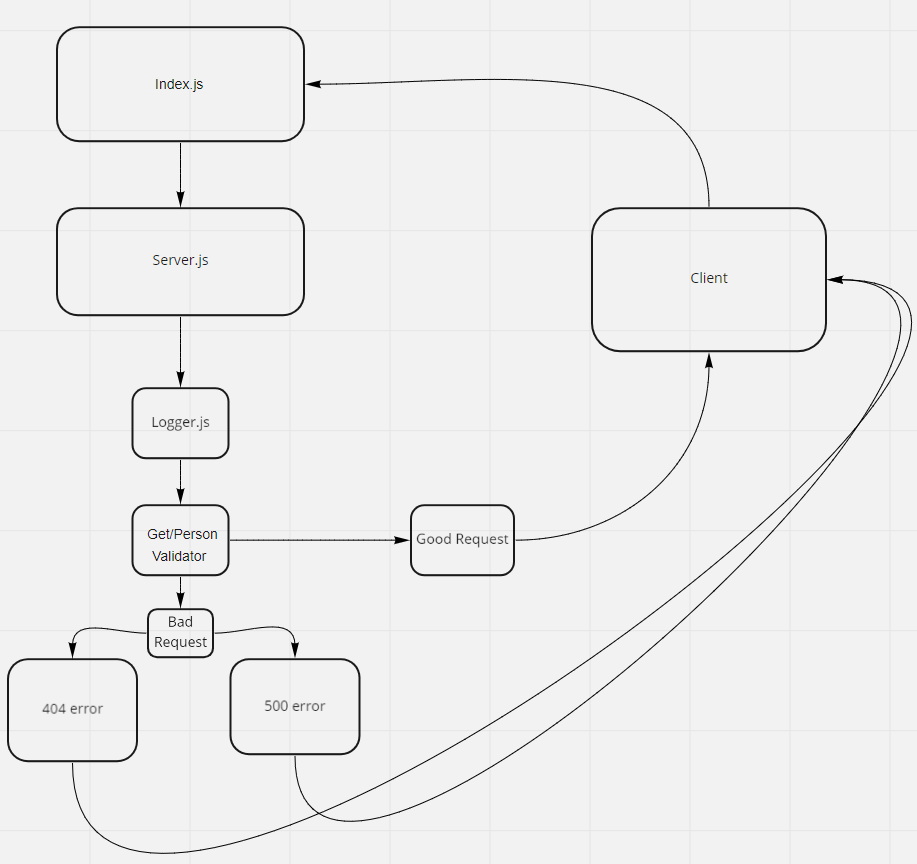

# basic-express-server
Created by Bryce Pfingston

## Installation  
npm i { jest, express, dotenv, supertest }  
  
## Summary of Problem Domain  
getting a name to come through a server, and having errors go off if there is no name, or string is empty.

## Links to application deployment  
 
Heroku: https://basic-express-server-bryce.herokuapp.com//  
Githut: https://github.com/bpfingston/basic-express-server
  
## Include embedded UML

## Talk about your routes

Path: /people
Accepts a string.
responds with a string.